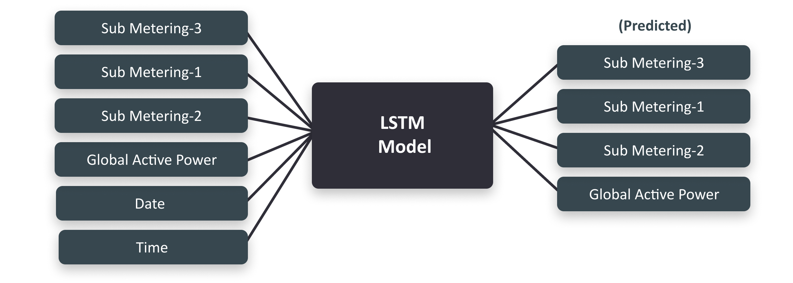
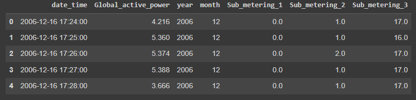
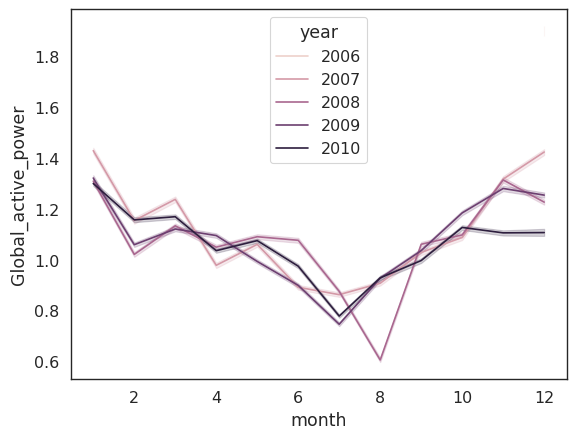
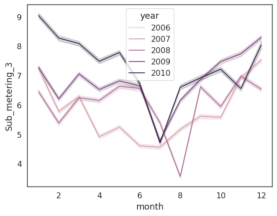
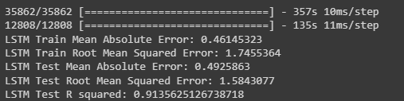
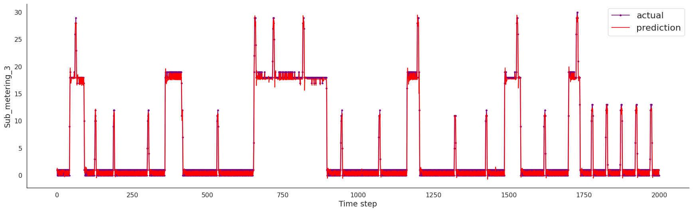

# Using an LSTM Neural Network to Forecast Energy Usage

## What is being solved here

As non-renewable sources of energy continue to deplete, it is more important than ever to improve energy efficiency. Our project is solving the issue with energy consumption.

## Goals, Environment, Adaptation

The goal of our system is to provide insight into energy usage and predict future usage in order to optimize energy consumption and stay within local energy guidelines. Our environment is any enclosed space that uses energy (home, office, etc.). Our system is able to adapt to the environment by taking in past energy usage data and predicting the energy usage of different parts of the building.



## The Data

The dataset we used was from the UCI website (https://archive.ics.uci.edu/ml/datasets/individual+household+electric+power+consumption) that included time series data over 4 years of energy usage from a house in France. It has four main energy detailed columns and three columns that showed how different parts of the house used that energy. The reason we chose to use this case study of a dataset is because we felt that it captures what our team envisioned the data to look like for our system to work off of. If this were to be implemented in the real world, we would expect the data to be similar to the one shown here.

| Date | Time | Global Active Power | Global Reactive Power | Global Intenstity | Current | Sub-Metering 1 | Sub-Metering 2 | Sub-Metering 3 |
| :--- | :--: | :------------------ | :-------------------- | :---------------- | :------ | :------------- | :------------- | :------------- |

The 3 different Sub-Meetering columns tells us the energy expenditure on those 3 zones of the household.
Note that Global Active Power is measured in kilowatts, whereas the sub-metering 1,2, and 3 are all measured in watt-hours. Sub-metering 1 corresponds to the kitchen, sub-metering 2 corresponds to the laundry room, and sub-metering 3 corresponds to the electric water-heater and air conditioner. The other columns were not used in the modeling for the sake of scope.

## Preprocessing

We decided to exclude three of the four energy detailed columns since those columns seemed to describe the same thing but in different ways; we focused on the "Global Active Power" column. Some of the data ended up missing (had ? or 'NA' in place of numbers) so we had to cut out the rows that included any missing data.
We formatted 'Date' and 'Time' columns to a single 'date_time'. For our project we are using: 'date_time', 'Global_active_power', 'year', 'month', 'Sub_metering_1', 'Sub_metering_2', ‘Sub_metering_3’.



## Visualizing

Since we are mostly focusing on the subzones of a building, we decided to plot the predcited vs actual energy outputs each of the subzones for both models in order to compare them.





## Training

### Extracting the data

Using the `pandas` library, we load the UCI dataset from a text file and then convert the date and time columns as detailed earlier. Then, using an 80/20 test/train split, we train over 3 epochs using the `LSTM` model from the `keras` library.

```python
# Transform the Global_active_power column of the data DataFrame into a numpy array of float values
dataset = df[['Global_active_power','Sub_metering_1', 'Sub_metering_2', 'Sub_metering_3']]

# Scale the values between 0 and 1
scaler = MinMaxScaler(feature_range=(0, 1))

# Fit the MinMaxScaler to the transformed data and transform the values
dataset = scaler.fit_transform(dataset)

# Split the transformed data into a training set (80%) and a test set (20%)
train_size = int(len(dataset) * 0.80)
val_size = int(train_size*.70) #Splits train into 70-30, 70->actual train, 30->validation
test_size = len(dataset) - train_size

# Based on the constructed sizes, separate the train, validation, and test datasets
train, val, test = dataset[0:val_size,:], dataset[val_size:train_size], dataset[train_size:len(dataset),:]

print(f'train: {train.shape}')
print(f'val: {val.shape}')
print(f'test: {test.shape}')

```

### Hyperparameter

We chose these pretty much randomly by trial and error and looking up the general parameters for our type of model.

```python
#General
dropout = 0.2
num_epochs = 3
batch_size = 1240
in_shape=(X_train.shape[1], X_train.shape[2])

#LSTM
num_lstm_units = 100

#MLP, just to compare the results with the LSTM
num_hidden_layers = 4
hidden_nodes = 32
out_shape = 4
activation = 'relu'
```

### Creating the Model Itself

```python
def LSTM_Model(num_lstm_units, in_shape):
  # Defining the LSTM model
  model = Sequential()

  # Adding the first layer with 100 LSTM units and input shape of the data
  model.add(LSTM(num_lstm_units, input_shape=in_shape))

  # Adding a dropout layer to avoid overfitting
  model.add(Dropout(0.2))

  # Adding a dense layer with 4 units to make predictions
  model.add(Dense(4))

  # Compiling the model with mean squared error as the loss function and using Adam optimizer
  model.compile(loss='mean_squared_error', optimizer='adam')

  return model
```

```python

#Initializing Model
lstm_model = LSTM_Model(num_lstm_units, in_shape)

#Training the Model
lstm_history = lstm_model.fit(X_train, Y_train, epochs=num_epochs, batch_size=batch_size, validation_data=(X_val, Y_val),
                    callbacks=[EarlyStopping(monitor='val_loss', patience=4)], verbose=1, shuffle=False)
```

## How to use

Since we made our system on a specific dataset, there isn't much in terms of how to use it. Extract the dataset from the zip file. Next in your code cell to read the dataset insert the path file for the dataset that was extracted.
Simply run each cell one at a time. The only things that you might change are the file locations of the dataset and where to store the model once it has completed training. If you wish to use another dataset, then the data should be similarly formatted to the one provided.

## Evaluation

For the evaluation we used Mean Absolute Error, Root Mean Squared Error, and R squared.

```python
# make predictions
lstm_train_predict = lstm_model.predict(eval_X_train)
lstm_test_predict = lstm_model.predict(eval_X_test)
# invert predictions, due to transformations that occurred earlier

lstm_train_predict = scaler.inverse_transform(lstm_train_predict)
lstm_Y_train = scaler.inverse_transform(eval_Y_train)
lstm_test_predict = scaler.inverse_transform(lstm_test_predict)
lstm_Y_test = scaler.inverse_transform(eval_Y_test)
```



The graph below compares the actual energy expenditure of one of the zones to the predicted energy expenditure from out model.


